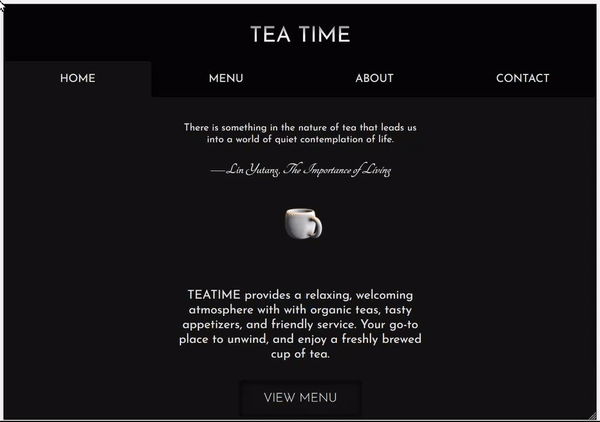

# Tea Time
A sample restaurant page created using React

View live [demo](https://sher-s7.github.io/react-restaurant-page/)

Spinning teacup animation created using Adobe After Effects, and [react-sprite-animator](https://www.npmjs.com/package/react-sprite-animator)

3D model used: https://www.blendswap.com/blend/10878

### Mobile Responsive

### Keyboard Accessibility

